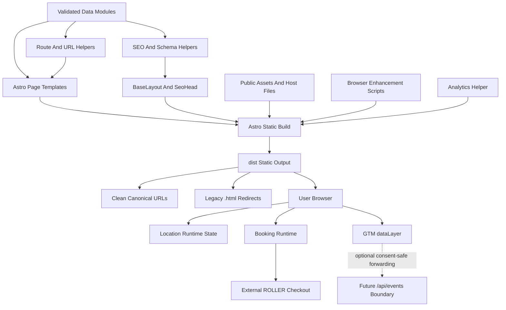

# Architecture Research: Astro Migration

**Project:** Time Mission Website Astro Migration
**Domain:** Brownfield static marketing/location website
**Researched:** 2026-04-29
**Overall confidence:** HIGH for Astro static architecture and current-code boundaries; MEDIUM for analytics/server-event implementation details until GTM, ROLLER, and consent tooling choices are confirmed.

## Recommendation

Migrate to Astro as a static site generator, not as an application framework. The current site already works as static HTML plus progressive browser enhancement; Astro should replace copied markup, duplicated SEO/schema, and handwritten route files with generated static output while preserving the runtime behavior contract.

Use `output: 'static'`, clean extensionless routes, and a no-trailing-slash URL policy. Astro documentation confirms static output prerenders pages by default, file-based routing lives under `src/pages`, dynamic routes use `getStaticPaths()`, `public/` is the static-asset home for files that must be copied through, and `build.format: 'file'` pairs naturally with `trailingSlash: 'never'` for no-slash URLs.

The migration should be data-first but not CMS-first. Location data, route metadata, SEO fields, schema inputs, navigation entries, FAQ content, group landing page metadata, and analytics labels should become validated TypeScript data modules. Markdown/content collections can wait until there is real editorial authoring value.

## Target Architecture

## Component Boundaries

### Layout And Head

| Component | Responsibility | Must Not Own |
|-----------|----------------|--------------|
| `BaseLayout.astro` | HTML shell, global CSS links/imports, GTM bootstrap slot, canonical URL, core meta defaults, schema injection slot, body classes/data attributes | Page-specific business facts, location lookup logic, event construction |
| `SeoHead.astro` or `src/lib/seo.ts` | Title, description, canonical, Open Graph/Twitter, robots directives, schema serialization helpers | Visible page content, hardcoded location facts |
| `GlobalScripts.astro` | Includes browser enhancement scripts in a stable order | Inline business logic or per-page tracking decisions |

Boundary rule: layouts accept prepared props. They should render final metadata and scripts but should not derive durable business facts directly from copied literals.

### Shared UI Components

| Component | Responsibility | Data Inputs | Must Not Own |
|-----------|----------------|-------------|--------------|
| `Nav.astro` | Desktop/mobile nav markup, location picker trigger, canonical internal links | navigation data, open/coming-soon locations | Location persistence, localStorage, booking URL resolution |
| `LocationPicker.astro` | Static picker/list markup and data attributes consumed by browser JS | validated locations | Browser state mutations |
| `Footer.astro` | Footer structure, default/global contact areas, link groups, newsletter markup | footer links, selected-location placeholders | Runtime selected-location formatting |
| `TicketPanel.astro` | Booking panel markup and stable IDs/classes | open locations, CTA labels | External navigation, analytics dispatch, iframe checkout logic |
| `FAQ.astro` | Accessible FAQ markup for global, group, and location pages | FAQ data | Schema eligibility decisions unless passed in |
| `Breadcrumbs.astro` | Visible breadcrumbs and `BreadcrumbList` input shape | route metadata | URL policy |

Boundary rule: components render semantic HTML and stable selectors. Browser behavior remains explicit in scripts so Astro does not create hidden client-side coupling.

### Page Templates

| Template | Routes | Responsibility |
|----------|--------|----------------|
| `HomePage.astro` | `/` | Preserve current homepage sections, hero, conversion CTAs, location selection entry points, testimonials, and FAQ blocks |
| `MarketingPage.astro` | `/about`, `/missions`, `/gift-cards`, `/faq`, `/contact`, policy pages | Render existing static pages from page metadata and section content without redesign |
| `GroupPage.astro` | `/groups`, `/groups/[slug]` | Render group/event SEO landing pages from validated group data |
| `LocationPage.astro` | `/[locationSlug]` via `getStaticPaths()` | Render open and coming-soon location pages from location data with status-aware CTAs, local SEO, and schema |
| `LocationsIndex.astro` | `/locations` | Render location directory from location data |
| `NotFound.astro` | `/404` plus static 404 output | Preserve current not-found behavior and static host compatibility |

Boundary rule: page templates compose components and pass data downward. They may choose which sections appear, but they should not duplicate helper logic for URLs, booking destinations, schema, or analytics labels.

### Data And Helpers

| Module | Responsibility | Consumers |
|--------|----------------|-----------|
| `src/data/locations.ts` | Validated location records, preserving current `data/locations.json` fields and adding country/locale/timezone/currency readiness | location pages, nav, footer, booking, schema, checks |
| `src/data/routes.ts` | Canonical route registry and legacy `.html` redirect mapping | layouts, sitemap, redirects, checks |
| `src/data/groups.ts` | Group/event landing page content, FAQs, CTA labels, SEO inputs | group pages, sitemap, schema |
| `src/data/navigation.ts` | Header/footer nav groups and labels | nav, footer, internal-link checks |
| `src/lib/routes.ts` | `canonicalPath()`, `legacyHtmlPath()`, `locationPath()`, `groupPath()`, redirect generation helpers | all pages, browser scripts if exported/copied |
| `src/lib/booking.ts` | `getBookingDestination()`, coming-soon fallback, gift-card destination, tracking-safe CTA context | TicketPanel, location pages, analytics |
| `src/lib/schema.ts` | Organization, WebSite, BreadcrumbList, FAQPage, LocalBusiness/EntertainmentBusiness JSON-LD builders | SeoHead and page templates |
| `src/lib/analytics-contract.ts` | Event names, required properties, consent fields, event ID shape, PII guard constants | browser analytics helper, tests, future server endpoint |

Boundary rule: data modules are the source of truth; helper modules derive values. Components and pages consume derived values rather than reimplementing derivation.

### Browser Runtime

| Script | Migration Stance | Responsibility |
|--------|------------------|----------------|
| `locations` runtime | Preserve first, simplify later | Selected-location persistence, DOM hydration for location-dependent footer/nav/ticker fields, `tm:location-changed` event |
| `nav` runtime | Preserve first | Mobile nav, location overlay, scroll state, legacy localStorage healing if still needed |
| `ticket-panel` runtime | Adapt to clean URL helpers and external checkout | Panel open/close, selected location, coming-soon fallback, outbound booking dispatch |
| `roller-checkout` runtime | Default-off legacy fallback | Only loaded if iframe checkout remains explicitly required |
| `a11y` runtime | Preserve or replace with native accessible components after parity | Skip link, dialog roles, focus traps, keyboard behavior |
| `analytics` runtime | New shared boundary | `dataLayer.push`, consent checks, event ID creation, optional server forwarding |

Boundary rule: browser scripts enhance static markup. They should not fetch core business data if Astro already emitted the needed attributes, except during the compatibility phase for existing `window.TM` behavior.

## Data Flow Direction

### Build-Time Data Flow

1. Existing durable facts are migrated into validated `src/data/*` modules.
2. Data modules feed route helpers, SEO helpers, schema helpers, and page templates.
3. Page templates pass prepared props into Astro components.
4. Astro renders static HTML, JSON-LD, links, and data attributes.
5. Astro copies `public/` assets and host files into `dist/`.
6. Verification reads `dist/`, not just source files, to confirm canonicals, redirects, sitemap, schema, internal links, and host files.

Direction: `data -> helpers -> pages/components -> dist -> verification`.

No reverse dependency should exist from components back into raw JSON files. Components receive props; helpers read data.

### Runtime Data Flow

1. Browser loads static HTML/CSS with meaningful default content already present.
2. Enhancement scripts attach listeners to stable IDs/classes/data attributes.
3. Location runtime restores selected location from `localStorage` and updates only the UI regions that genuinely depend on user-selected state.
4. Booking runtime resolves the clicked CTA context from DOM attributes and shared destination rules.
5. Analytics runtime receives normalized event input, applies consent and PII rules, generates or attaches `event_id`, pushes to `window.dataLayer`, and optionally forwards a consent-safe payload to the server boundary.
6. External checkout navigation occurs after the tracking dispatch path has had a chance to run.

Direction: `static markup -> enhancement scripts -> analytics/booking side effects -> external systems`.

Runtime scripts should not mutate canonical metadata, sitemap-visible URLs, JSON-LD, or page identity. Those belong to build time.

## URL Strategy

Canonical URLs should be extensionless with no trailing slash:

- `/`
- `/missions`
- `/groups`
- `/groups/birthdays`
- `/locations`
- `/philadelphia`

Legacy `.html` URLs should redirect directly to canonical paths:

- `/missions.html -> /missions`
- `/groups/birthdays.html -> /groups/birthdays`
- `/philadelphia.html -> /philadelphia`
- `/contact-thank-you.html -> /contact-thank-you`

Recommended Astro route shape:

| Current Static File | Astro Source | Canonical Output |
|---------------------|--------------|------------------|
| `index.html` | `src/pages/index.astro` | `/` |
| `missions.html` | `src/pages/missions.astro` | `/missions` |
| `groups.html` | `src/pages/groups/index.astro` or `src/pages/groups.astro` | `/groups` |
| `groups/birthdays.html` | `src/pages/groups/[slug].astro` | `/groups/birthdays` |
| `locations/index.html` | `src/pages/locations.astro` or `src/pages/locations/index.astro` | `/locations` |
| `philadelphia.html` | `src/pages/[locationSlug].astro` | `/philadelphia` |

Use one route helper as the sole path generator for internal links, canonicals, sitemap entries, schema URLs, redirect mappings, and browser booking fallbacks. This is the highest-leverage URL migration guard because the current codebase has several `.html` assumptions.

Astro config implications:

- Use `output: 'static'`.
- Set `site` to the production origin so `Astro.url`, canonicals, sitemap URLs, and schema URLs can be absolute where required.
- Use `trailingSlash: 'never'` and `build.format: 'file'` for no-trailing-slash static output consistency.
- Keep `_headers`, `_redirects`, `robots.txt`, `sitemap.xml` or generated sitemap output in `public/` or otherwise verify they land in `dist/`.

## Analytics Integration Boundaries

Analytics should be a shared contract, not scattered `dataLayer.push()` calls.

### Browser Boundary

`src/scripts/analytics.ts` or equivalent should own:

- `track(eventName, properties)` as the only public event API.
- `window.dataLayer` initialization and GTM-ready pushes.
- Event ID generation and timestamp normalization.
- Consent state reads and Consent Mode v2-ready defaults.
- PII filtering rules.
- Optional `navigator.sendBeacon()` or `fetch(..., { keepalive: true })` forwarding to a future server endpoint.

Components should only render `data-analytics-*` attributes or call the helper through small event listeners. They should not construct GTM payloads directly.

### Event Contract Boundary

Define required fields once:

- `event_name`
- `event_id`
- `event_source` (`browser`, later `server`)
- `page_path`
- `page_type`
- `cta_id`
- `cta_label`
- `location_id` when applicable
- `destination_url` for outbound booking/gift-card events
- `consent_state`
- `timestamp`

Start with booking and revenue-adjacent events first: `location_selected`, `ticket_panel_opened`, `booking_cta_clicked`, `outbound_checkout_clicked`, `gift_card_clicked`, `group_page_cta_clicked`, `contact_form_started`, `contact_form_submitted`, and `contact_form_failed`.

### Server Boundary

Do not make server-side analytics a prerequisite for static launch. Define the contract and reserve a boundary:

- Future endpoint shape: `POST /api/events` via Cloudflare Pages Functions or Workers.
- Initial implementation may be a documented no-op or omitted until backend scope is chosen.
- If implemented, server forwarding must receive only consent-safe, non-PII payloads and preserve `event_id` for dedupe with browser events.

### ROLLER Boundary

The marketing site owns outbound booking intent. ROLLER owns checkout-step and purchase visibility. The Astro migration should:

- Use tracked external checkout links by default.
- Keep iframe checkout as default-off legacy support unless explicitly retained.
- Include ROLLER GTM/GA4 setup and purchase validation in launch readiness, but not couple static page rendering to ROLLER admin availability.

## SEO And Schema Boundaries

SEO must be generated from the same route/data helpers as the page content.

| Concern | Owner |
|---------|-------|
| Canonicals | route helper + `SeoHead` |
| Titles/descriptions | page/location/group SEO data |
| Sitemap | route registry + data modules |
| Redirects | route registry legacy mapping |
| JSON-LD | schema helper modules |
| LocalBusiness eligibility | location status/content rules |
| FAQ schema | FAQ data only where visible FAQ content exists |
| AI extractability | page templates and content structure |

Open and coming-soon locations need different schema behavior. Coming-soon pages should not emit misleading hours, active booking affordances, or fully-open local business claims unless the visible page content supports them.

## Suggested Build Order

### 1. Baseline And Parity Harness

Lock the current site as the reference before adding Astro. Capture current `npm run verify`, representative screenshots, URL inventory, SEO/schema inventory, booking behavior notes, and analytics requirements. This phase reduces migration ambiguity and prevents accidental redesign.

### 2. Astro Static Skeleton

Install Astro, configure static output, add `BaseLayout`, copy global CSS/assets/host files through the Astro build, and render one low-risk page. Validate `dist/` exists, host files copy through, and visual parity is achievable without changing the CSS architecture.

### 3. Route Registry And Clean URL Contract

Build `src/lib/routes.ts` and redirect generation/checks before page conversion accelerates. Add canonical clean routes, `.html` redirect coverage, no redirect loops, no stale `.html` internal links, and sitemap generation/checking against `dist/`.

### 4. Location Data Module And Helpers

Move or mirror `data/locations.json` into a validated build-time module. Preserve current fields first, then add international-ready fields. Implement location, booking, schema, and SEO helpers. This unlocks location pages, nav, footer, booking CTAs, and local SEO without duplicating facts.

### 5. Shared Components

Convert `Nav`, `Footer`, `LocationPicker`, `TicketPanel`, `SeoHead`, `FAQ`, and breadcrumbs while preserving selectors and DOM structure that current scripts/tests rely on. Replace `build.sh` partial sync only after all pages using the ticket panel render through Astro.

### 6. Representative Page Templates

Convert one page per template family: homepage, broad marketing page, group page, open location page, coming-soon location page, locations index, FAQ/contact/policy page. Update smoke tests and visual comparisons after each family rather than after every page.

### 7. Bulk Page Conversion

Generate the remaining pages through the established templates and data modules. At this point, conversion should mostly be content mapping, not architecture work.

### 8. Booking Flow Modernization

Switch default booking behavior from iframe-first interception to tracked external links. Preserve or intentionally replace `?book=1` behavior with tests. Keep coming-soon fallback rules data-driven.

### 9. Analytics And Consent Foundation

Add the shared analytics helper, GTM bootstrap, Consent Mode v2-ready defaults, event contract tests, and outbound checkout tracking. Add server-event readiness only at the boundary level unless backend scope is approved.

### 10. SEO, Schema, Local SEO, And AI Readiness

Generate canonical metadata, sitemap, JSON-LD, local SEO rules, FAQ schema, and optional `llms.txt` from data. Verify open vs coming-soon behavior and machine-readable consistency.

### 11. Verification And Cutover

Run verification against built Astro output. Add checks for clean routes, legacy redirects, host files, internal links, booking destinations, analytics events, schema, local SEO, accessibility, visual parity, and smoke flows. Deploy to preview, validate Cloudflare behavior, GTM DebugView, ROLLER outbound links, 404 handling, and rollback procedure before production cutover.

## Anti-Patterns To Avoid

### Componentizing Before Data Stabilizes

Moving copied HTML into components before route/data helpers exist will preserve current duplication in a new shape. Stabilize paths, location data, and booking helpers early.

### Mixing URL Policy Into Components

Hardcoding `/foo.html`, `/foo/`, or `/foo` inside components will cause redirect, sitemap, schema, and analytics drift. Use one route helper everywhere.

### Treating Analytics As Inline CTA Code

Scattered `dataLayer.push()` calls will make consent, PII rules, server forwarding, and dedupe inconsistent. Components can declare context; the analytics helper owns payloads.

### Letting Astro Islands Become The Default

This site does not need React/Vue islands for the first migration. Plain Astro components plus small browser scripts match the existing architecture and keep JavaScript low.

### Replacing ROLLER Attribution With Assumptions

Outbound intent can be tracked by the marketing site. Completed checkout and purchase events depend on ROLLER/GTM configuration and should be validated separately.

## Roadmap Implications

Recommended phase structure:

1. **Baseline parity and Astro skeleton** - Establishes the current site as the contract and proves Astro can emit static output without redesign.
2. **Routing, redirects, and data foundation** - Builds the shared route/data helpers required by every later page and prevents `.html` drift.
3. **Shared components and template conversion** - Replaces duplicated nav/footer/ticket/SEO/page markup with Astro components while preserving selectors and CSS.
4. **Location and booking modernization** - Converts the highest-risk revenue paths with tested clean URL and external checkout behavior.
5. **Analytics, consent, and event contract** - Centralizes GTM and server-ready events after CTA markup and destinations are stable.
6. **SEO/schema/local SEO verification** - Ensures generated routes, metadata, structured data, and AI/search extractability agree before launch.
7. **Cutover readiness and rollback** - Runs full preview validation and keeps the old static site deployable until production behavior is proven.

Phase ordering rationale:

- URL and data helpers must precede broad component/page conversion because they feed canonicals, links, redirects, sitemap, schema, booking, and analytics context.
- Shared components should precede bulk pages because they reduce repeated migration work and preserve DOM contracts consistently.
- Analytics should be architected early but instrumented deeply after CTA/page structures stabilize.
- SEO/schema checks must run against built output because source-level correctness is not enough for a static cutover.

## Confidence Assessment

| Area | Confidence | Notes |
|------|------------|-------|
| Astro static output and routing | HIGH | Verified against current Astro docs via Context7 for static output, file routing, `getStaticPaths()`, `site`, `trailingSlash`, `build.format`, and `publicDir`. |
| Current codebase boundaries | HIGH | Based on `.planning` codebase map and GitNexus architecture showing central `window.TM`, ticket panel, Roller, static host, and verification layers. |
| Data/module boundaries | HIGH | Directly follows current source-of-truth requirements and avoids duplicated business facts. |
| Analytics/server boundary | MEDIUM | Event-contract shape is clear, but final server endpoint, consent provider, GTM container behavior, and ROLLER admin setup need implementation-phase decisions. |
| SEO/schema boundary | HIGH | Current requirements clearly make local SEO/schema launch-critical; exact schema fields need page-by-page validation. |

## Sources

- Astro documentation via Context7: `output: 'static'` prerenders pages by default; `src/pages` file-based routing; dynamic static routes require `getStaticPaths()`; `site`, `trailingSlash`, `build.format`, and `publicDir` are Astro config concerns.
- `.planning/PROJECT.md`: migration requirements, URL decisions, analytics/consent requirements, local SEO, rollback, and constraints.
- `.planning/codebase/ARCHITECTURE.md`: current static HTML, CSS, browser JS, location data, ticket panel, and verification architecture.
- `.planning/codebase/STRUCTURE.md`: current directory responsibilities and static-site conventions.
- `ARCHITECTURE.md`: GitNexus execution-flow map and migration notes.
- `astro_migration_rebuild_b5408d44.plan.md`: preflight decisions and proposed migration phase outline.
