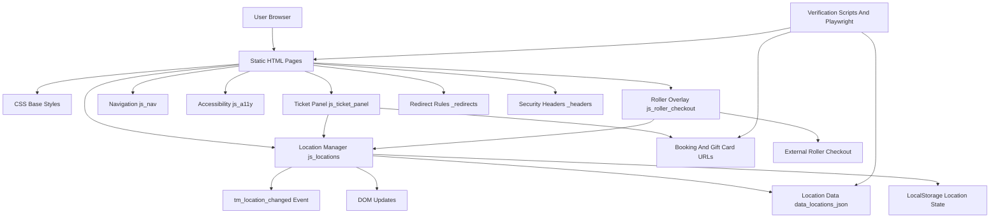

# Time Mission Website Architecture

Generated from the GitNexus knowledge graph for `time-mission-website`.

Index snapshot:

- Files indexed: 77
- Symbols indexed: 282
- Execution flows detected: 12
- Primary graph cluster: `Js`

## Overview

Time Mission Website is a static marketing site made of hand-authored HTML pages, shared CSS, browser JavaScript modules, JSON data, and verification scripts. The runtime architecture is intentionally lightweight: pages are served as static assets, shared browser scripts hydrate navigation/location behavior, and `data/locations.json` provides the canonical location dataset used by the client-side location manager and booking flows.

The current implementation has three main architectural forces:

- **Static page delivery:** HTML files such as `index.html`, `missions.html`, `groups.html`, and location pages are the public page surface.
- **Shared browser behavior:** JavaScript in `js/locations.js`, `js/ticket-panel.js`, `js/nav.js`, `js/a11y.js`, and `js/roller-checkout.js` adds stateful behavior after page load.
- **Data-driven location state:** `data/locations.json` feeds location selection, footer contact details, booking links, map links, gift card URLs, and coming-soon behavior.

GitNexus currently identifies one primary functional cluster, `Js`, because the execution graph is dominated by browser JavaScript flows. Static HTML, CSS, data, redirects, and verification scripts remain important architectural areas even when they do not appear as separate symbol clusters in the graph.

## Architecture Diagram

## Functional Areas

### Static Page Surface

The main content is represented by static HTML documents at the repository root and under subdirectories:

- Homepage and broad marketing pages: `index.html`, `missions.html`, `groups.html`, `gift-cards.html`, `faq.html`, `contact.html`.
- Location pages: `philadelphia.html`, `mount-prospect.html`, `manassas.html`, `west-nyack.html`, `lincoln.html`, `antwerp.html`, plus coming-soon pages such as `houston.html`, `dallas.html`, `orland-park.html`, and `brussels.html`.
- Group subpages: `groups/birthdays.html`, `groups/corporate.html`, `groups/private-events.html`, `groups/field-trips.html`, `groups/holidays.html`, `groups/bachelor-ette.html`.
- Policy/support pages: `privacy.html`, `terms.html`, `cookies.html`, `accessibility.html`, `code-of-conduct.html`, `licensing.html`, `waiver.html`, `404.html`.

These pages are currently duplicated static output rather than generated templates. Shared behavior is attached through common CSS classes, `body[data-location]` attributes, and script includes.

### Location Manager

Primary file: `js/locations.js`

The location manager owns the public `window.TM` API:

- `TM.locations`
- `TM.current`
- `TM.ready`
- `TM.load()`
- `TM.get(id)`
- `TM.getOpen()`
- `TM.getByRegion(region)`
- `TM.select(id)`
- `TM.clear()`
- `TM.restore()`
- `TM.updateDOM()`

Its responsibilities are:

- Load `data/locations.json` through a path resolved by `getDataUrl()`.
- Persist selected location state to `localStorage` under `tm_location`.
- Heal older location state from `timeMissionLocation`.
- Update nav text, booking links, footer contact details, hours, ticker messaging, testimonials, and active location UI.
- Emit `tm:location-changed` when a location is selected.

GitNexus traces show this as a central execution hub for page personalization.

### Ticket Panel And Booking Flow

Primary file: `js/ticket-panel.js`

The ticket panel attaches behavior to site-wide booking CTAs such as `.btn-tickets` and `.btn-book-now`.

Core responsibilities:

- Normalize selected location values.
- Query `window.TM.get()` for location data.
- Populate the ticket panel dropdown from `window.TM.locations`.
- Route non-location pages through a location page with `?book=1`.
- Route location pages directly to booking URLs.
- Send coming-soon locations back to their location pages rather than dead checkout URLs.
- Expose `window.TMTicketPanel`.

This flow depends on `js/locations.js` being available and, where possible, waits on `window.TM.ready` before hydrating location-driven options.

### Roller Checkout Overlay

Primary file: `js/roller-checkout.js`

The Roller overlay is an additional checkout interception layer. It injects Roller’s CDN checkout iframe script and tries to open the Roller overlay for locations with `rollerCheckoutUrl`.

Core responsibilities:

- Resolve location from the ticket panel, location dropdown links, `body[data-location]`, or `localStorage`.
- Look up `loc.rollerCheckoutUrl` through `window.TM.get()`.
- Call `window.RollerCheckout.setCheckoutUrl(url)` and `window.RollerCheckout.show()` when available.
- Intercept booking clicks during capture phase so it can run before bubble-phase ticket panel handlers.

This area is important but also a migration concern: the current Astro plan moves toward external tracked Roller links as the default flow and treats iframe checkout as legacy/default-off unless retained intentionally.

### Navigation And Accessibility Behavior

Primary files:

- `js/nav.js`
- `js/a11y.js`

These scripts provide supporting behavior around site navigation, mobile menus, location dropdowns, focus handling, keyboard support, and accessibility improvements. They are part of the browser behavior layer but were not among the top GitNexus process traces.

### Data And Hosting Configuration

Primary files:

- `data/locations.json`
- `_redirects`
- `_headers`
- `sitemap.xml`
- `robots.txt`

`data/locations.json` is the most important non-code data source. It contains location IDs, slugs, status, addresses, contact information, hours, booking URLs, Roller checkout URLs, navigation labels, maps, FAQ arrays, ticker text, and gift card URLs.

Hosting-related files define redirect behavior, security/CSP headers, robots behavior, and sitemap coverage for static deployment.

### Verification Tooling

Primary files:

- `package.json`
- `playwright.config.js`
- `tests/smoke/site.spec.js`
- `scripts/check-location-contracts.js`
- `scripts/check-sitemap.js`
- `scripts/check-components.js`
- `scripts/check-booking-architecture.js`
- `scripts/check-accessibility-baseline.js`
- `scripts/check-internal-links.js`

The verification layer guards location data contracts, sitemap coverage, duplicated component sync, booking URL architecture, accessibility baselines, internal links, and browser smoke behavior.

## Key Execution Flows

GitNexus detected 12 execution flows. The top five traces are below.

### 1. BookOrOpenPanel To NormalizeLocation

Type: intra-community  
Steps: 7  
Primary file: `js/ticket-panel.js`

Trace:

1. `bookOrOpenPanel`
2. `openTicketPanel`
3. `syncBookingBtn`
4. `getBookingUrl`
5. `getLocationPage`
6. `getLocation`
7. `normalizeLocation`

This is the self-contained ticket-panel flow for turning a booking click into either panel behavior or a normalized location lookup.

### 2. BookOrOpenPanel To Get

Type: cross-community  
Steps: 7  
Primary files: `js/ticket-panel.js`, `js/locations.js`

Trace:

1. `bookOrOpenPanel`
2. `openTicketPanel`
3. `syncBookingBtn`
4. `getBookingUrl`
5. `getLocationPage`
6. `getLocation`
7. `get`

This is the key bridge from ticket panel behavior into the `window.TM` location API. It is the most important integration point between booking UI and location data.

### 3. Init To FormatAddress

Type: cross-community  
Steps: 5  
Primary file: `js/locations.js`

Trace:

1. `init`
2. `select`
3. `updateDOM`
4. `updateFooterLocation`
5. `formatAddress`

This flow describes how initial location state reaches footer location content and formats a structured address into display markup.

### 4. Init To FormatHoursTable

Type: cross-community  
Steps: 5  
Primary file: `js/locations.js`

Trace:

1. `init`
2. `select`
3. `updateDOM`
4. `updateFooterLocation`
5. `formatHoursTable`

This flow updates footer hours for the selected location. It depends on the shape and completeness of each location’s `hours` object.

### 5. Init To UpdateTestimonials

Type: intra-community  
Steps: 4  
Primary file: `js/locations.js`

Trace:

1. `init`
2. `select`
3. `updateDOM`
4. `updateTestimonials`

This flow personalizes testimonial content based on the selected location state.

## Additional Detected Flows

GitNexus also detected these flows:

- `Init → GetFocusable`
- `Clear → FormatAddress`
- `Clear → FormatHoursTable`
- `Init → GetDataUrl`
- `Init → Get`
- `ResolveLocationForButton → Normalize`
- `Clear → UpdateTestimonials`

These reinforce the same major architecture: most runtime behavior flows through the location manager, ticket panel, and DOM update functions.

## Design Implications

The graph highlights several important planning constraints:

- `js/locations.js` is the central dependency for location-aware UI. Changes to its API affect booking, nav, footer, and checkout behavior.
- `js/ticket-panel.js` and `js/roller-checkout.js` both intercept booking interactions. Their ordering and event phases matter.
- `data/locations.json` must remain consistent with any embedded fallback data in `js/locations.js` until the architecture removes that duplication.
- URL generation currently assumes `.html` paths in places such as location page routing. The Astro migration to extensionless URLs needs a deliberate replacement for these helpers.
- Verification scripts should continue to protect location contracts and booking architecture during migration because those are the most connected areas in the graph.

## Future Migration Notes

The planned Astro migration should preserve these boundaries while replacing duplicated static HTML with generated routes and components:

- Convert `data/locations.json` into a validated data module consumed by Astro and browser scripts.
- Replace ad hoc `.html` URL construction with a route helper that can emit canonical clean URLs and legacy redirects.
- Move shared nav, footer, location picker, and ticket panel markup into Astro components while keeping browser behavior explicit.
- Keep outbound booking attribution and ROLLER checkout behavior separate: the marketing site should track booking intent, while ROLLER/GTM should own checkout-step and purchase events.
- Retain Playwright and static verification as migration gates for the location and booking flows identified by GitNexus.
